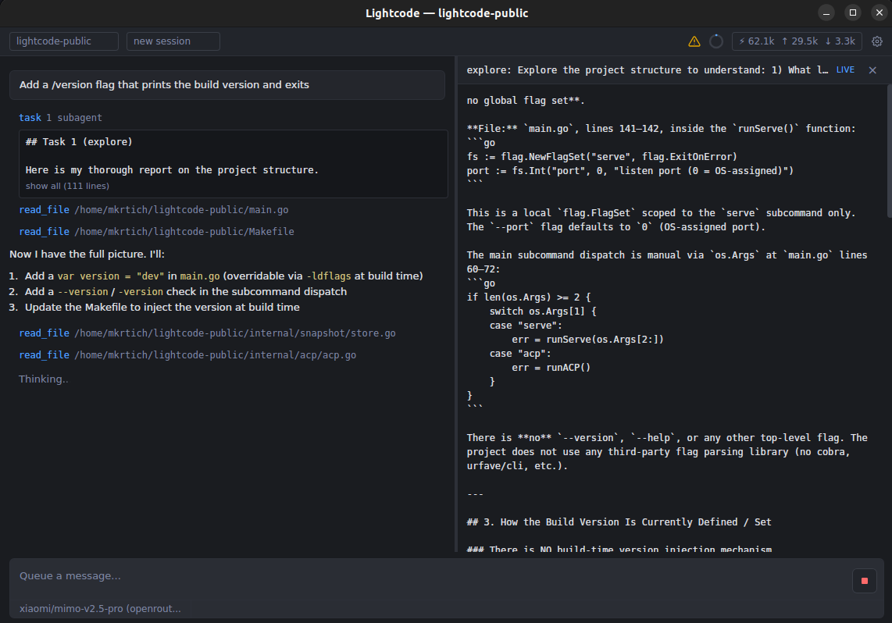

<h1 align="center">Lightcode</h1>

<p align="center">
  A coding agent that works with any OpenAI-compatible LLM provider.<br>
  Desktop app · Terminal CLI · HTTP daemon · ACP stdio adapter — one Go binary, four interfaces.
</p>

<p align="center">
  <a href="LICENSE"></a>
  <a href="https://goreportcard.com/report/github.com/MMinasyan/lightcode"></a>
</p>

<p align="center">
  
</p>

---

### Goals

| | |
|---|---|
| **Model freedom** | No vendor lock-in — any OpenAI-compatible endpoint |
| **Simplicity** | One binary, minimal moving parts, no external services |
| **Reliability** | Reversion, permissions, and snapshots that don't break |
| **Economics** | Bring your own providers, mix cloud and local |

---

### Features

**Providers** — OpenAI, OpenRouter, MiniMax, Z.ai, Ollama, DeepSeek, Mistral, Groq, Google Gemini, llama.cpp, and anything else that speaks the OpenAI API schema. Configure N providers simultaneously, switch mid-session.

**Tools** — `read_file` · `write_file` · `edit_file` · `run_command` · `save_memory` · `search_memory` · `search_history` · `diagnostics` · `workspace_symbol` · `task`

**Snapshots** — Every file edit is snapshotted by turn. Revert code, revert history, or fork from any point. Copy-based, no git dependency.

**Permissions** — Glob-based allow/deny/ask rules at global and per-project levels. No bypass, no subagent escapes.

**Context compaction** — Automatic pruning and summarization when approaching the context window limit.

**LSP** — Diagnostics and symbol search across Go, Python, TypeScript/JS, Rust, C/C++, C#. Auto-detected, auto-installed.

**Subagents** — Delegate tasks to concurrent LLM loops with scoped tools and independent context.

**Memory** — Save and search project and global memories across sessions using embedded vector search (no external service).

---

### Quick start

#### Prerequisites

- Go 1.26+
- Node.js
- [Wails v2](https://wails.io/docs/gettingstarted/installation)
- Git LFS

<details>
<summary>Linux: install WebKitGTK</summary>

```bash
# Debian / Ubuntu
sudo apt install libwebkit2gtk-4.1-dev

# Fedora
sudo dnf install webkit2gtk4.1-devel

# Arch
sudo pacman -S webkit2gtk-4.1
```

macOS and Windows have the webview engine built in.
</details>

#### Build

```bash
git lfs pull
wails build
```

Binary: `build/bin/lightcode`

#### Configure

Lightcode ships with no providers. On first run it creates `~/.lightcode/config.json` with an empty skeleton. API keys live in environment variables (or `~/.lightcode/.env`), referenced by name:

```json
{
  "providers": {
    "openrouter": {
      "base_url": "https://openrouter.ai/api/v1",
      "api_key_env": "OPENROUTER_API_KEY",
      "models": ["openai/gpt-5.5", "xiaomi/mimo-v2.5-pro"]
    },
    "llama-cpp": {
      "base_url": "http://localhost:8080/v1",
      "api_key_env": "",
      "models": ["qwen3.6-35b-a3b"]
    }
  },
  "default_model": { "provider": "openrouter", "model": "openai/gpt-5.5" }
}
```

#### Run

```bash
lightcode                       # Desktop GUI
lightcode cli                   # Terminal REPL
lightcode serve --port 8080     # HTTP+SSE daemon
lightcode acp                   # JSON-RPC over stdio
```

---

### License

[MIT](LICENSE)