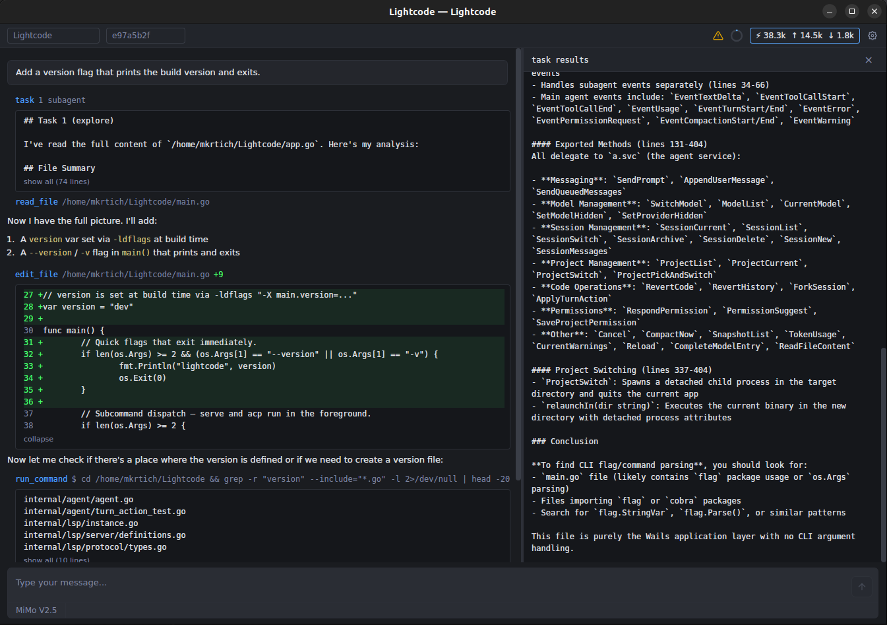

<h1 align="center">Lightcode</h1>

<p align="center">
  A coding agent that works with any OpenAI-compatible LLM provider.<br>
  Desktop app · Terminal CLI · ACP stdio adapter — one Go binary, three interfaces.
</p>

<p align="center">
  <a href="LICENSE"></a>
  <a href="https://goreportcard.com/report/github.com/MMinasyan/lightcode"></a>
</p>

<p align="center">
  
</p>

---

### Goals

| | |
|---|---|
| **Model freedom** | No vendor lock-in — any OpenAI-compatible endpoint |
| **Simplicity** | One binary, minimal moving parts, no external services |
| **Reliability** | Reversion, permissions, and snapshots that don't break |
| **Economics** | Bring your own providers, mix cloud and local |

---

### Features

**Providers** — Bundled metadata for OpenAI, OpenRouter, Alibaba/Qwen, Google Gemini, xAI/Grok, DeepSeek, Moonshot/Kimi, Mistral, MiniMax, Z.ai, Together, Groq, Fireworks, and Xiaomi MiMo. Add Ollama, llama.cpp, or any other OpenAI-compatible endpoint through config. Configure N providers simultaneously, switch mid-session.

Lightcode uses the OpenAI Chat Completions shape with streaming and tool calls. Provider compatibility still varies: some OpenAI-compatible models stream text correctly but do not reliably support streamed tool calls. Test a new provider/model with a real tool call before relying on it.

**Tools** — `read_file` · `write_file` · `edit_file` · `apply_patch` · `run_command` · `process` · `sleep` · `diagnostics` · `workspace_symbol` · `task`

**Snapshots** — Every file edit is snapshotted by turn. Revert code or fork from any point. Copy-based, no git dependency.

**Permissions** — Glob-based allow/deny/ask rules at global and per-project levels. No bypass, no subagent escapes.

**Context compaction** — Automatic pruning and summarization when approaching the context window limit.

**LSP** — Diagnostics and symbol search across Go, Python, TypeScript/JS, Rust, C/C++, C#. Auto-detected; servers auto-installed where supported.

**Subagents** — Delegate tasks to concurrent LLM loops with scoped tools and independent context.

---

### Quick start

#### Install

Linux amd64 is the first supported release target. Install the prebuilt binary from the latest GitHub Release:

```bash
curl -fsSL https://github.com/MMinasyan/lightcode/releases/latest/download/install.sh | sh
```

Run Lightcode:

```bash
lightcode
```

Linux amd64 on Debian/Ubuntu and Fedora is the first supported release target. macOS, Windows, Linux arm64, and package-manager formats are not part of this first release target.

#### Build from source

Source builds are for development. They require Go 1.26+, Node.js, [Wails v2](https://wails.io/docs/gettingstarted/installation), and WebKitGTK development headers.

```bash
# Debian / Ubuntu build dependencies
sudo apt update
sudo apt install libgtk-3-dev libwebkit2gtk-4.1-dev
```

```bash
wails build -tags webkit2_41
```

Binary: `build/bin/lightcode`

Optional install:

```bash
install -Dm755 build/bin/lightcode ~/.local/bin/lightcode
```

#### Configure

Lightcode ships with bundled provider metadata, but no credentials and no preset default model. On first run it creates `~/.lightcode/config.json` with an empty skeleton. API keys live in environment variables (or `~/.lightcode/.env`), referenced by name from provider `transport.api_key_env` fields:

```json
{
  "providers": {
    "openrouter": {
      "transport": {
        "headers": {
          "HTTP-Referer": "https://my-app.example"
        }
      },
      "models": {
        "z-ai/glm-5.1": {
          "name": "Z.ai GLM-5.1"
        }
      }
    },
    "ollama": {
      "transport": {
        "base_url": "http://localhost:11434/v1",
        "api_key_env": ""
      },
      "models": {
        "qwen3.6:27b": {
          "name": "Qwen3.6 27B",
          "context_window": 262144,
          "max_output_tokens": 65536
        }
      }
    }
  }
}
```

Put model selections in `~/.lightcode/agents.json`:

```json
{
  "primary": {
    "model": "openrouter/z-ai/glm-5.1"
  }
}
```

Example key setup:

```bash
mkdir -p ~/.lightcode
printf 'OPENROUTER_API_KEY=...\n' >> ~/.lightcode/.env
```

Shell-exported environment variables take precedence over values in `~/.lightcode/.env`.

#### Permissions

Global permissions live in `~/.lightcode/config.json`. Project permissions are saved per project when you choose "Allow for project" in a permission prompt.

```json
{
  "permissions": {
    "allow": ["read_file(/src/**)", "run_command(git status *)"],
    "deny": ["read_file(**/.env)", "write_file(**/.env)"],
    "ask": ["run_command(git push *)"]
  }
}
```

Path prefixes in permission rules:

- `/foo` — project-relative
- `~/foo` — home-relative
- `//foo` — absolute
- no matching rule — ask

#### Run

Run Lightcode from the project directory you want it to work on:

```bash
lightcode                       # Desktop GUI
lightcode cli                   # Terminal REPL
lightcode acp                   # JSON-RPC over stdio
```

Useful CLI commands:

- `/model` — switch model
- `/session` — list or switch sessions
- `/project` — switch project
- `/revert` — revert code at the selected turn or fork from it
- `/fork` — open the fork/revert menu
- `/context` — show token usage
- `/compact` — compact context now
- `/copy` — copy the last assistant response
- `/exit` — exit

ACP clients drive Lightcode over newline-delimited JSON-RPC on stdio.

#### Commands

Beyond the run modes above, the binary ships utility commands: `version`, `doctor` (offline install/config diagnostics), `upgrade` (self-update; verifies the release's SHA-256 checksum before installing), `uninstall`, `completion`, `models`, and `config`. Run `lightcode help` for the full reference.

#### Data locations

- `~/.lightcode/config.json` — user config
- `~/.lightcode/.env` — local API keys
- `~/.lightcode/projects/` — project metadata, sessions, snapshots, memories, and project permissions
- `~/.lightcode/cache/` — discovery and runtime caches

---

### License

[MIT](LICENSE)
